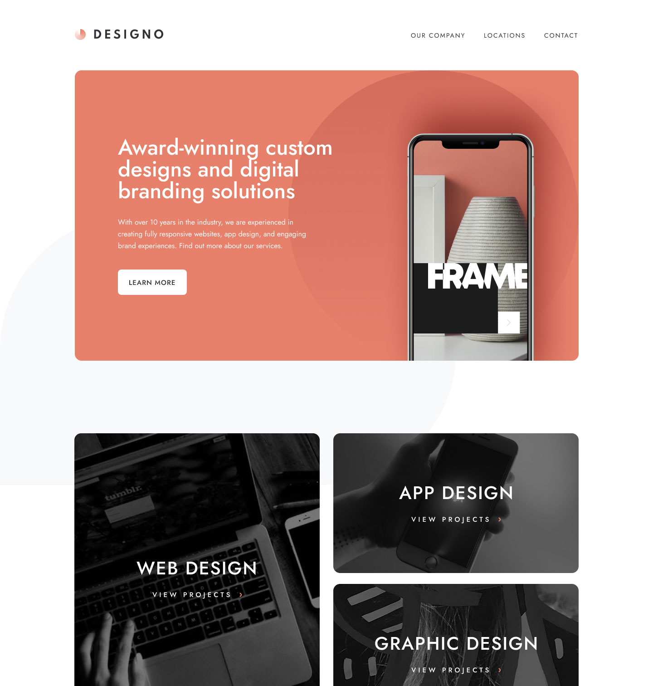

# Frontend Mentor - Designo agency website solution

This is a solution to the [Designo agency website challenge on Frontend Mentor](https://www.frontendmentor.io/challenges/designo-multipage-website-G48K6rfUT). Frontend Mentor challenges help you improve your coding skills by building realistic projects.

This is the repository for the FM Designo Website project. The project aims to create a modern and responsive website for a fictional design agency called FM Designo.

## Table of Contents)

- [Overview](#overview)
  - [The challenge](#the-challenge)
  - [Screenshot](#screenshot)
  - [Links](#links)
- [My process](#my-process)
  - [Built with](#built-with)
  - [What I learned](#what-i-learned)
  - [Continued development](#continued-development)
  - [Useful resources](#useful-resources)
- [Author](#author)
- [Acknowledgments](#acknowledgments)
- [License](#license)

## Overview

### The challenge

Users should be able to:

- View the optimal layout for each page depending on their device's screen size
- See hover states for all interactive elements throughout the site
- Receive an error message when the contact form is submitted if:
  - The `Name`, `Email Address` or `Your Message` fields are empty should show "Can't be empty"
  - The `Email Address` is not formatted correctly should show "Please use a valid email address"
- **Bonus**: View actual locations on the locations page maps (we recommend [Leaflet JS](https://leafletjs.com/) for this)

### Screenshot

### Links

- Solution URL: [Design Multi-page Website](https://www.frontendmentor.io/solutions/designo-agency-multipage-website-ugM4IeDz4X)
- Live Site URL: [https://fabulous-lollipop-90c845.netlify.app](https://fabulous-lollipop-90c845.netlify.app)

## Built with

- Semantic HTML5 markup
- CSS custom properties
- Flexbox
- CSS Grid
- Mobile-first workflow
- Clean and modern design
- Responsive layout for different devices
- Showcase of design agency services and portfolio
- Contact form with validation
- Interactive elements and animations

## Technologies Used

- HTML5
- CSS3
- JavaScript

### What I learned

I wrote about half of this over a year ago, but because of family issues, I had to put it aside. I've learned a lot since then and gave me a chance to refactor the code with updated programming knowledge. This was the largest project I worked on to date.

### Continued development

I was able to use a template for the three services pages, which helped the development. I would like to learn more about using templates and how to use them effectively. I also need to work on separating the CSS into smaller files.

### Useful resources

- [Kevin Powell](https://www.kevinpowell.co/) - His videos and content were a big help in learning how to use CSS Grid and Flexbox. I would recommend his videos and courses to anyone learning CSS.
- [Kevin Powell Youtube](https://www.youtube.com/@KevinPowell)
- [John Smilga](https://johnsmilga.com/) His and Kevin's videos on mobile menuswere a big help learning how to code mobile menus.

## Author

- Github - [David Turner](https://github.com/brodiewebdt)
- Frontend Mentor - [@brodiewebdt](https://www.frontendmentor.io/profile/brodiewebdt)

## License

This project is licensed under the [MIT License](LICENSE).
